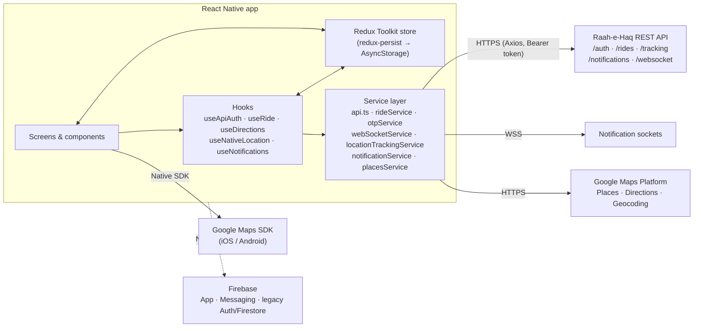

# Raah-e-Haq

A ride-hailing app for Pakistan, built with React Native and TypeScript for iOS and Android.

Raah-e-Haq gives passengers and drivers separate experiences inside one codebase. Passengers sign up, choose a pickup and destination on Google Maps, add stops, pick a vehicle, see a fare estimate in PKR and request a ride. Drivers register with their vehicle and documents, wait for admin approval, then go online to receive and manage rides. The app talks to a REST backend for accounts, rides, tracking and notifications, and uses Firebase and the Google Maps Platform for native services.

> **Status:** active development. The passenger booking flow and the API service layer are the most complete parts. Some screens still use placeholder data. See [Project status](#project-status) for an honest breakdown.

---

## Contents

- [Features](#features)
- [Project status](#project-status)
- [Architecture](#architecture)
- [Tech stack](#tech-stack)
- [Project structure](#project-structure)
- [Getting started](#getting-started)
- [Further documentation](#further-documentation)
- [Screenshots](#screenshots)
- [Team](#team)

---

## Features

### Authentication and onboarding

| Feature | Details |
| --- | --- |
| Email and password login | `POST /auth/login`. The token is saved to AsyncStorage and added to every request as a Bearer header. |
| Phone OTP login | Send and verify a one-time code (`/auth/send-otp`, `/auth/verify-otp`), with phone-number checks done on the device first. |
| Multi-step registration | One wizard for both roles: Personal info, Vehicle info, Documents and Review. Drivers upload a driver photo, CNIC and vehicle photos from the camera or gallery. These are sent as `multipart/form-data`. |
| Admin approval gate | New accounts start as `pending`. Until an admin activates the account, the user sees a dedicated pending-approval screen. |
| Password recovery | Forgot-password request from the login screen. |
| Session handling | On launch, any stored token is checked against the API. The Axios interceptor tries a token refresh when it gets a `401`. Sign-out is available from both Settings screens. |
| Role-based routing | After login, the user's `role` (`passenger` / `driver`) decides which navigator is mounted. |

### Passenger: booking a ride

- A step-by-step booking flow: **home → pickup → destination → vehicle → fare → requesting**, with progress chips and a back button that steps through the stages.
- Location search through Google Places Autocomplete and Place Details.
- "Use my current location", with reverse geocoding through the Google Geocoding API. If that fails, it falls back to OpenStreetMap Nominatim.
- Up to **5 optional stops**, added from search or by tapping the map.
- A route preview from the Google Directions API, with waypoints for stops. The route is drawn as an animated polyline.
- Vehicle options: bike, car (economy / comfort / premium, sent as a `service_level`) and van.
- A fare estimate: PKR 50 base fare plus PKR 25 per km. Distance is the straight-line (haversine) distance, and time is roughly estimated from it.
- Ride creation through `POST /rides`, and cancellation of a pending request.
- A home dashboard with quick actions for booking, ride history, favourite places and wallet.

### Driver

- Online / offline toggle on a live map that centres on the driver's position.
- Ride lifecycle actions (accept, start, complete) that update ride status through the rides API.
- A dedicated pending-approval screen for drivers who are not yet active.
- Driver profile with image picker, settings and sign-out.

### Maps and location

- `react-native-maps` with the Google provider. A `SafeMapView` wrapper and a `MapErrorBoundary` keep a map failure from crashing the screen.
- A custom `useNativeLocation` hook built on `@react-native-community/geolocation`. It handles runtime permissions on Android and iOS, high-accuracy fixes and emulator defaults.
- A `LocationTrackingService` that watches position and pushes driver location to `/tracking/update-location` at a set interval.
- The API client also covers nearby-driver lookup (`/tracking/drivers-in-radius`), latest driver location and ride path.

### Real-time updates and notifications

- `WebSocketService` subscribes to ride updates, driver ride requests and per-user notification channels. It reconnects automatically, up to 5 attempts.
- `useRide` refreshes the active ride every 10 seconds as a fallback to the socket.
- An in-app notification service with pagination, mark-as-read, mark-all-read and an unread count, plus a local AsyncStorage cache.
- A global `NotificationManager` for toasts and modal alerts.

### UI and platform

- Light and dark themes that follow the system setting, with the theme applied to React Navigation as well.
- Shared, themed components: buttons, text inputs, toasts, modals and error boundaries.
- Android and iOS location, camera and photo-library permission prompts are declared in the native projects.

---

## Project status

This is a working codebase, not a finished product. To be clear about where it stands:

| Area | State |
| --- | --- |
| REST API service layer (auth, rides, stops, tracking, notifications, sockets) | Implemented |
| Passenger booking flow (search, stops, route, fare, request) | Implemented |
| Registration wizard and approval gate | Implemented |
| Driver map and ride handling | In progress: being moved onto the new ride API |
| Passenger ride tracking screen | In progress |
| In-app chat | UI only. Built with `react-native-gifted-chat`, with local messages and no backend yet. |
| Wallet, ride history, favourite places, notification lists | UI with placeholder data |
| Push notifications (FCM) | Native setup done (Firebase Messaging pod, APNs registration in `AppDelegate`). The JS token and message handling are not wired yet. |
| Google Sign-In | SDK configured at startup. The login button currently shows a "not available" message. |
| Fare calculation | Done on the device for now. Not yet backed by an API. |

The codebase started on Firebase Auth and Firestore and is being migrated to the REST backend. Some legacy Firebase services (`firebaseAuth.ts`, `userService.ts`, `authThunks.ts`) and their onboarding screens are still in the tree.

---

## Architecture

### High-level view



### Navigation

Navigation uses React Navigation 7. `AuthFlow` reads `apiAuth` from Redux and mounts one of three trees:

```
NavigationContainer (themed)
└── AuthFlow
    ├── AuthStack ............... not authenticated
    │   ├── Login
    │   ├── Signup  (multi-step registration wizard)
    │   └── PhoneAuth
    ├── DriverPendingApproval ... authenticated, status != active
    └── RootNavigation .......... authenticated, active, has role
        ├── PassengerStack
        │   ├── PassengerTabs: Home · Map · Notifications · Chat · Settings
        │   └── Profile · Messages · RideTracking · RideHistory
        │       FavoriteLocations · Wallet · Notifications
        └── DriverStack
            ├── DriverTabs: Home · Map · Notifications · Chat · Settings
            └── DriverProfile · DriverMessages · DriverMap
```

`RootNavigation` is keyed on the user's role, so a role change remounts the whole navigator cleanly.

### State management

Redux Toolkit holds app state, and redux-persist saves it to AsyncStorage.

| Slice | Purpose | Persisted |
| --- | --- | --- |
| `apiAuth` | Current user, token, OTP state, profile completion. Drives navigation. | Yes |
| `auth` | Legacy Firebase auth state | Yes |
| `user` | Role and display name | Yes |
| `ride` | Ride mode, request state, active ride, bids | No |
| `trip` | Current trip and history | No |

A custom redux-persist transform clears auth errors and resets any stuck `loading` / `failed` status when the app restarts. Without it, a login error from a killed session would come back on the next launch. Async work runs in `createAsyncThunk` thunks (`store/thunks/apiThunks.ts`). Typed `useAppDispatch` / `useAppSelector` hooks are exported from the store.

### How data flows

1. **Screens** call hooks (`useApiAuth`, `useRide`, `useDirections`, `useFare`, `useNativeLocation`) and never call the network directly.
2. **Hooks** handle loading and error state and call the **service layer**.
3. **`api.ts`** wraps a single Axios instance with:
   - a request interceptor that adds the Bearer token from AsyncStorage,
   - a response interceptor that tries `/auth/refresh` on `401` and clears stored credentials if that fails,
   - a registry of cancellable requests, so screens can cancel in-flight calls when they unmount.
4. **Domain services** (`rideService`, `otpService`, `notificationService`, `locationTrackingService`, `webSocketService`) model the backend's resources with TypeScript interfaces for requests and responses.
5. **Real-time updates** come from WebSocket subscriptions, with periodic polling of the active ride as a fallback.

### Notable patterns

- **Role-based navigation keyed on Redux state**, with no imperative redirects.
- **A service and hook split** that keeps screens thin and the backend contract in one place.
- **Error boundaries around maps**, because native map views are the most crash-prone part of a ride-hailing UI.
- **Stage-driven booking UI**: the passenger map screen is a small state machine (`home → pickup → destination → vehicle → fare → requesting`) rather than several separate screens.
- **Module path alias** (`src/...`) set up in both Babel (`babel-plugin-module-resolver`) and `tsconfig.json`.

---

## Tech stack

| Category | Library | Version |
| --- | --- | --- |
| Framework | React Native (New Architecture enabled) | 0.80.1 |
| | React | 19.1.0 |
| | TypeScript | 5.0.4 |
| Navigation | @react-navigation/native | ^7.1.17 |
| | @react-navigation/native-stack | ^7.3.25 |
| | @react-navigation/bottom-tabs | ^7.4.6 |
| State | @reduxjs/toolkit | ^2.8.2 |
| | react-redux | ^9.2.0 |
| | redux-persist + AsyncStorage | ^6.0.0 / ^2.2.0 |
| Networking | axios | ^1.12.2 |
| Firebase | @react-native-firebase/app, auth, firestore | ^23.2.0 |
| | @react-native-firebase/messaging | ^23.4.0 |
| | @react-native-firebase/storage | ^23.3.1 |
| Auth SDK | @react-native-google-signin/google-signin | ^15.0.0 |
| Maps and location | react-native-maps | ^1.26.6 |
| | @react-native-community/geolocation | ^3.4.0 |
| Chat UI | react-native-gifted-chat | ^2.8.1 |
| Media | react-native-image-picker | ^8.2.1 |
| UI | react-native-reanimated | ^4.1.0 |
| | react-native-gesture-handler | ^2.28.0 |
| | react-native-linear-gradient | ^2.8.3 |
| | react-native-vector-icons | ^10.3.0 |
| | react-native-toast-message | ^2.3.3 |
| Tooling | Jest, ESLint (`@react-native/eslint-config`), Prettier | 29 / 8 / 2.8.8 |

**Platform targets:** Android `minSdk 24`, `targetSdk 36`. iOS deployment target `16.0`.

---

## Project structure

```
.
├── App.tsx                     # Providers (Redux, Theme, Notifications) + themed NavigationContainer
├── index.js                    # App registry entry
├── src/
│   ├── app/
│   │   ├── navigation/         # AuthFlow, RootNavigation, stacks/, tabs/
│   │   └── providers/          # ReduxProvider, AuthProvider, ThemeProvider
│   ├── screens/
│   │   ├── Auth/               # Login, PhoneAuth, registration wizard (steps/)
│   │   ├── Passenger/          # Home, Map (booking), tracking, history, wallet, chat/
│   │   └── Driver/             # Home, Map, ride, profile, pending approval, chat
│   ├── components/             # Shared UI, map wrappers, error boundaries
│   │   ├── passenger/          # Booking-flow pieces: search, stops, vehicles, fare cards
│   │   └── driver/
│   ├── hooks/                  # useApiAuth, useRide, useDirections, useFare, useNativeLocation, ...
│   ├── services/               # api.ts, rideService, otpService, webSocketService, placesService, ...
│   ├── store/                  # Store setup, slices/, thunks/
│   ├── config/mapsConfig.ts    # Maps key, default region, marker and fare settings
│   ├── theme/                  # Colours, typography, light/dark themes
│   ├── types/                  # Navigation types
│   └── utils/                  # Location helpers
├── android/                    # Native Android project
├── ios/                        # Native iOS project (CocoaPods)
└── __tests__/                  # Jest tests
```

---

## Getting started

### Prerequisites

- **Node.js 22.** The version is pinned in `.nvmrc`, and `package.json` requires `>=18`.
- A working React Native environment for your platform. Follow the official [Set Up Your Environment](https://reactnative.dev/docs/set-up-your-environment) guide (Android Studio and SDK, Xcode).
- **Ruby and Bundler** for CocoaPods on iOS (a `Gemfile` is included).
- A **Firebase project** with Android and iOS apps registered.
- A **Google Cloud project** with these APIs enabled: Maps SDK for Android, Maps SDK for iOS, Places API, Directions API and Geocoding API.
- Access to a running instance of the Raah-e-Haq backend API.

### 1. Install dependencies

```sh
npm install
```

For iOS, also install the pods:

```sh
bundle install            # first time only
cd ios && bundle exec pod install && cd ..
```

### 2. Configure services

Use your own project's values for each item below. Never commit production keys.

| What | Where |
| --- | --- |
| Firebase Android config | `android/app/google-services.json` |
| Firebase iOS config | `ios/GoogleService-Info.plist` |
| Google Maps key (Android SDK) | `android/app/src/main/AndroidManifest.xml`, `<meta-data android:name="com.google.android.geo.API_KEY">` |
| Google Maps key (iOS SDK) | `ios/RaaHeHaq/AppDelegate.swift` (`GMSServices.provideAPIKey`) and `GMSApiKey` in `ios/RaaHeHaq/Info.plist` |
| Google web-services key (Places, Directions, Geocoding) | `API_KEY` in `src/config/mapsConfig.ts` |
| Google Sign-In web client ID | `webClientId` in `src/services/googleSignIn.ts` |
| Backend base URL | `API_BASE_URL` in `src/services/api.ts`. The same host is also referenced in `notificationService.ts`, `locationTrackingService.ts` and `webSocketService.ts`. |

### 3. Run

Start Metro:

```sh
npm start
```

In a second terminal, build and launch the app:

```sh
npm run android
npm run ios
```

### Other scripts

| Command | Description |
| --- | --- |
| `npm run lint` | Run ESLint |
| `npm test` | Run Jest |

### Troubleshooting

- **Metro starts with the wrong Node version.** On Android, `run-android` opens Metro in a new terminal, which may not load your `nvm` setup. Run `npm start` yourself first with Node 22 active, then run `npm run android`.
- **iOS build fails after changing native dependencies.** Run `bundle exec pod install` again in `ios/`.

---

## Further documentation

| Document | Contents |
| --- | --- |
| [RIDE_MODULE_API_FLOW.md](RIDE_MODULE_API_FLOW.md) | End-to-end ride lifecycle: status flow, passenger and driver API sequences, WebSocket events, multi-stop rules |
| [COMPLETE_API_DOCUMENTATION.md](COMPLETE_API_DOCUMENTATION.md) | Ride, stop, navigation, tracking, notification and WebSocket endpoints with request and response examples |
| [API_DOCUMENTATION.md](API_DOCUMENTATION.md) | Authentication API (registration, login, OTP, password reset) and an index of other backend modules |
| [REDUX_HOOKS_FIX.md](REDUX_HOOKS_FIX.md) | Engineering note on the typed Redux hooks setup |

---

## Screenshots

Screenshots will be added here.

---

## Team

Built by **[Attay Rasool](https://github.com/AttayR)** (lead React Native developer), with contributions from Hamna Javed and Iqra Ashraf.
